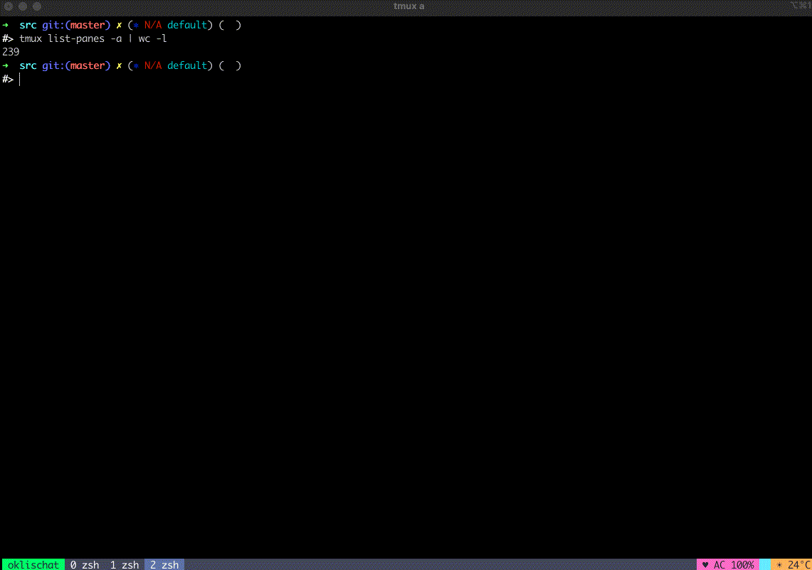

# Fulltext Search Across All Tmux Panes

Tmux plugin that allows you to perform a fulltext search across the live contents of all panes in all windows in all running sessions.

## Usage

Hit `prefix` + `@open_search_panes_key` (default: v), enter regex to search for.
Plugin finds all panes in all windows/sessions containing the expression, then opens a live search (fzf) with previews to further drill down into the results.
Hit Enter to open the selected pane, or Escape to abort.

